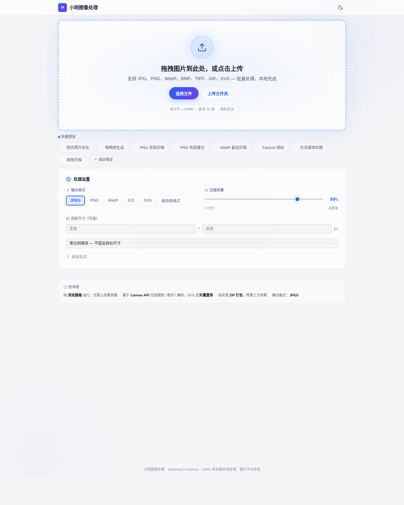

<p align="center">
  
</p>

<h1 align="center">小明图像处理 · Xiaoming Compress</h1>

<p align="center">
  <b>100% 浏览器本地运行的批量图片压缩神器</b><br/>
  压缩 · 格式转换 · 批量裁切 · ICO 生成 —— 图片不出本机，隐私零风险
</p>

<p align="center">
  
  
  
  
  
</p>

<p align="center">
  <a href="#-核心特性">核心特性</a> ·
  <a href="#-为什么是客户端">为什么是客户端</a> ·
  <a href="#-快速开始">快速开始</a> ·
  <a href="#-一键部署到-github-pages">部署到 Pages</a> ·
  <a href="#-技术栈">技术栈</a> ·
  <a href="#-路线图">路线图</a>
</p>

---

## 🎯 一句话介绍

> **小明图像处理（Xiaoming Compress）** 是一款开箱即用的批量图片处理 Web 应用。
> 你只需要在上传区里选好设置、拖入图片、点一下「开始处理」，剩下的交给浏览器 ——
> **所有像素处理都在你的设备上完成，图片永远不会离开你的电脑。**

没有后端、没有上传、没有等待、没有隐私焦虑。打开网页就能用，关掉网页什么都不留。

---

## ✨ 核心特性

| 🔧 能力 | 📋 说明 |
| :--- | :--- |
| **批量压缩** | 一次拖入数十张 JPG / PNG，按质量一键压缩，结果自动打包成 ZIP 下载 |
| **格式互转** | JPG ⇄ PNG ⇄ WebP 自由转换，也支持「保持原格式」批量重处理 |
| **ICO 生成** | 一张图一键生成 16/32/48/64/128/256 多尺寸图标，直接拿去当网站 Favicon |
| **等比例裁切** | 批量把图片裁切 / 缩放成统一分辨率，`cover` 居中裁切、`inside` 等比适配、`fill` 拉伸 |
| **文件夹上传** | 一键选择整个文件夹，仅处理其中的图片（JPG / PNG / WebP / BMP / TIFF / GIF / SVG） |
| **SVG 矢量处理** | 批量把 SVG 重排为统一正方形画布 + 透明出血外框；自动清洗 Figma 导出的类样式与断链，iconfont 直传无忧 |
| **预设模板** | 8 套开箱预设（网页照片 / 缩略图 / 社交封面 / Favicon …）+ 保存你自己的常用配置 |
| **自动下载** | 处理完成自动下载 ZIP，页面内还能「重新下载」，不怕手滑关掉 |
| **亮暗双主题** | 跟随系统自动切换，也可手动一键切换；深夜修图也不刺眼 |
| **零依赖打包** | ZIP 打包为自实现纯前端逻辑，整个应用无需任何第三方运行时依赖 |

---

## 🛡️ 为什么是「客户端」？

传统的图片压缩工具要么要你把照片传到服务器，要么得装个几十 MB 的客户端。
**Xiaoming Compress 走的是第三条路 —— 纯浏览器端（Client-Side）：**

- 🔒 **隐私满分**：图片只在本地 Canvas 里处理，断网也能用，没有任何上传动作。
- ⚡ **零等待**：没有网络往返，没有排队，处理速度取决于你电脑的算力。
- 💸 **托管免费**：纯静态文件，直接扔到 **GitHub Pages** 就能全球访问，零服务器成本。
- 📦 **部署简单**：不需要 Node、不需要数据库、不需要运维，拷贝 `dist/` 即可。

> 💡 **想要更高性能 / 大批量？** 仓库里还附带一套基于 **Sharp + libvips** 的 Node.js 服务端版本（`server/`），
> 适合需要服务端批量处理、MozJPEG 极致压缩的企业场景。二选一，随心切换。

---

## 🚀 快速开始

### 方式一：直接打开（最简单）

本项目构建后是纯静态文件，**双击 `dist/index.html` 即可在浏览器中使用**（部分浏览器对本地文件有限制，推荐用方式二）。

### 方式二：本地起一个静态服务

```bash
# 1. 安装依赖并构建前端
cd client
npm install
npm run build      # 产物在 client/dist/

# 2. 用任意静态服务器打开
npx serve dist
# 或
python3 -m http.server 8080 -d dist
```

浏览器访问 `http://localhost:8080` 即可。

### 方式三：开发模式（热更新）

```bash
cd client
npm install
npm run dev        # 默认 http://localhost:5173
```

---

## ☁️ 部署到 GitHub Pages

本应用是纯静态站点，部署到 GitHub Pages **完全免费**，且无需任何后端。

> 🌐 **已上线**：<https://weitao970320.github.io/image-compressor/>

### 当前采用：分支部署（gh-pages）

仓库已通过 `gh-pages` 分支部署，配置方式如下：

1. 进入仓库 **Settings → Pages → Build and deployment → Source**，选择 **Deploy from a branch**；
2. Branch 选 **`gh-pages`**，目录选 **`/ (root)`**，保存；
3. 访问 `https://<用户名>.github.io/image-compressor/`。

重新发布只需把最新的 `client/dist/` 推送到 `gh-pages` 分支即可。

### 可选：GitHub Actions 自动部署

如需推送到 `main` 即自动发布，在仓库根目录创建 `.github/workflows/deploy.yml`，内容如下：

```yaml
name: Deploy to GitHub Pages
on:
  push:
    branches: [main]
  workflow_dispatch:
permissions:
  contents: read
  pages: write
  id-token: write
concurrency:
  group: pages
  cancel-in-progress: true
jobs:
  build:
    runs-on: ubuntu-latest
    defaults:
      run:
        working-directory: client
    steps:
      - uses: actions/checkout@v4
      - uses: actions/setup-node@v4
        with:
          node-version: 20
          cache: npm
          cache-dependency-path: client/package-lock.json
      - run: npm ci
      - run: npm run build
      - uses: actions/configure-pages@v5
      - uses: actions/upload-pages-artifact@v3
        with:
          path: client/dist
  deploy:
    needs: build
    runs-on: ubuntu-latest
    environment:
      name: github-pages
      url: ${{ steps.deployment.outputs.page_url }}
    steps:
      - id: deployment
        uses: actions/deploy-pages@v4
```

> ⚠️ GitHub 要求推送工作流文件必须拥有 `workflow` 权限的 Token。若你的令牌没有该权限，
> 请用具备权限的账户推送此文件，并将 Pages 的 **Source** 改为 **GitHub Actions**。

### 手动构建

```bash
cd client && npm run build
# 将 dist/ 目录内容推送到 gh-pages 分支，或上传到任意静态托管（Vercel / Netlify / 对象存储）
```

---

## 🖥️ 可选：Node.js 高性能服务端版

如果你需要**服务端批量处理**或 **MozJPEG 极致压缩**，可以使用仓库内的 `server/`：

```bash
npm install          # 安装根目录依赖（express / sharp / multer …）
npm run server       # 启动 API 服务（默认 http://localhost:3001）
npm run dev          # 同时启动前端(5173) + 后端(3001) 开发
```

> 服务端版适合企业内网、大量图片批处理等场景；个人使用与公网托管，客户端版足矣。

---

---

## 🧩 SVG 处理与 iconfont 兼容

设计图标时，从 **Figma 导出 SVG → 上传 iconfont** 经常失败，根因通常是：SVG 缺少显式 `width/height`、`viewBox`，或依赖 `<style>` 类样式、`clip-path`/`mask` 的 `url(#...)` 引用。
本应用的 SVG 处理管线会做以下清洗，确保输出**合规、可兼容**：

| 问题 | Figma 常见写法 | 本应用处理 |
| :--- | :--- | :--- |
| 缺少尺寸 | 只有 `viewBox`，无 `width/height` | 显式补全 `width` / `height` / `viewBox`（数值，非百分比） |
| 类样式 | `<style>.a{fill:...}</style>` + `class="a"` | 内联为展示属性 `fill` 等，并移除 `<style>` 与 `class` |
| 断链引用 | `clip-path="url(#缺失)"` | 引用的 `defs` 不存在则移除该属性，避免解析失败 |
| 缺填充 | 图元无 `fill` | 自动补 `fill="currentColor"` |
| 贴边裁切 | 图形贴满画布 | 重排为**正方形画布 + 可配置透明出血外框**，四周留白 |

**批量用法**：选中「SVG」输出格式后，只需输入两项——
- **画布宽度**：输出正方形边长（如 `1024`）；
- **出血外框宽度**：图标四周的透明留白（留空默认取画布宽度的 10%）。

所有 SVG 会按**实际绘制范围（getBBox）居中**，得到尺寸统一、留白一致的图标集，可直接批量上传 iconfont。

> 💡 选择「保持原格式」处理 SVG 时，会保留原比例并收紧 `viewBox` 到实际内容（清理 Figma 的多余留白），不强制正方形。

## 🔤 图标字体（iconfont 模式）

把一批 SVG **直接合成一个图标字体**，类似 iconfont.cn 的用法：每个图标分配一个 PUA 码位（`U+E001` 起），生成 **TTF + WOFF** 字体、**CSS**、**演示页（demo.html）** 与 **glyphs.json**，全部打包成 ZIP 一键下载。

**使用步骤**
1. 在「输出格式」中选择 **图标字体**；
2. 设置 **字体名称**（如 `MyIcons`，将作为 `@font-face` 的 `font-family`）与可选的 **图标内边距**（画布内留白，避免贴边）；
3. 上传一批 SVG（支持多选 / 文件夹，仅 SVG 被纳入字体）；
4. 点击「开始处理」—— 结果区会出现图标预览网格，**点击任意图标即复制其字体类名**（如 `icon-home`）；
5. 字体包 ZIP 自动下载。

**在自己的项目中使用**

```html
<!-- 引入生成的 CSS -->
<link rel="stylesheet" href="MyIcons.css" />
<!-- 任意位置使用：class 即复制得到的字体类名 -->
<i class="icon icon-home"></i>
```

每个类名对应一条 `.icon-xxx::before { content: "\e001"; }` 规则，字体以 `currentColor` 着色，可随文字颜色变化。演示页 `demo.html` 本身就是一份可交互的预览，点击即可复制类名。

**技术要点**
- **码位与命名**：图标按顺序分配 `U+E001`、`U+E002`…，类名取 `icon-<文件名 slug>`（冲突自动追加序号）；
- **矢量转字形**：用 `opentype.js` 把每个图形的路径（`path/rect/circle/ellipse/polygon/line`，含圆弧 → 三次贝塞尔）归一化到 `unitsPerEm=1000` 的 em 方并翻转 Y 轴；
- **WOFF 封装**：TTF 经浏览器原生 `CompressionStream('deflate')` 逐表压缩、手写 `wOFF` 头，零额外依赖；
- **纯客户端**：所有合成在浏览器本地完成，SVG 不外传。

> ⚠️ 生成的是 **CFF 轮廓的 OpenType（sfnt 标记 `OTTO`）**，所有现代浏览器原生支持；若需老旧的 `.ttf`（glyf 轮廓）请改用 FontForge 等工具二次转换。

---

## 🧰 技术栈

<p align="left">
  
  
  
  
  
</p>

- **前端框架**：React 19 + Vite 8
- **处理引擎**：浏览器原生 `Canvas API`（缩放 / 裁切 / 编码）+ 自实现 ZIP 打包（STORE 模式，CRC32 校验）
- **设计语言**：「液态光 Liquid Light」—— 玻璃拟态面板、蓝紫辉光、Plus Jakarta Sans 字体
- **主题**：CSS 变量驱动，亮 / 暗自动跟随系统
- **可选后端**：Node.js + Express 5 + Sharp(libvips) + Multer

### 支持的格式与处理

| 输出格式 | 压缩质量 | 缩放裁切 | 备注 |
| :--- | :--- | :--- | :--- |
| JPEG | ✅ 可调 1–100% | ✅ | 自动剥离 EXIF |
| PNG | ➖ 无损 | ✅ | 体积主要由分辨率决定 |
| WebP | ✅ 可调 | ✅ | 依赖浏览器编码支持 |
| ICO | ➖ 多尺寸 | ✅ 等比适应·透明留白 | 内置 16–256 多尺寸 |
| SVG | ➖ 矢量 | ✅ 正方形画布 + 出血外框 | **iconfont 合规**：清洗类样式 / 断链引用，保留渐变 |
| 图标字体 | ➖ 矢量合集 | ✅ 内边距留白 | **批量 SVG → 字体**：生成 TTF + WOFF + CSS + 演示页 + 可复制类名 |

---

## 📸 界面预览



---

## 🗺️ 路线图

- [ ] 🧪 PNG 有损压缩（前端 pngquant / OxIPNG WASM）
- [ ] 🎨 实时压缩前后对比预览
- [ ] 📋 拖拽排序与单独重命名
- [ ] 🌐 多语言（中 / 英 / 日）
- [ ] 📦 单文件离线版（PWA，可安装到桌面）

---

## 📄 许可证

[MIT](LICENSE) © Xiaoming Compress

<p align="center">
  <sub>Made with ⚡ by Canvas & ☕ — 图片不出本机，压缩更安心。</sub>
</p>
